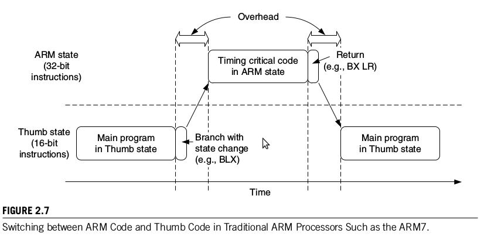

Tipps für Berichte
==================

Hier sind ein paar Tipps zum Schreiben von kleineren Berichten und
Ausarbeitungen. 

Für umfangreichere Texte wie Bachelor- und Masterarbeiten gelten
strengere Regeln [#f1]_!

.. index:: zitieren, Literaturangaben, Fussnote

.. index:: Gliederung

Der Kopf 
--------

Der Text beginnt mit einem Kopf, so wie bei diesem Demo-Bericht. Darin steht

.. index:: Kopf

- Hochschule Augsburg, Fakultät

- Name der Veranstaltung, z.B. "DVA Praktikum (Prof. Dr. Högl)"

- Titel des Berichtes. Bei diesem Text "Berichte mit Sphinx schreiben".

- Semester mit Jahreszahl, z.B. "Wintersemester 2019/2020.

- Der Autor oder die Autoren (jeweils Name, E-mail, Fach, Matrikelnr.)

  .. code-block:: text 

     Autor:

     Anna Muster, <Anna.Muster@hs-augsburg.de>, TI3, #99999

Sollte es mehrere Autoren geben, dann diese wie folgt mit E-mail Adresse,
Studiengang+Semester, Matrikel-Nummer untereinander unter ``Autoren:``
schreiben. Damit die Zeilen untereinander stehen, muss man einen senkrechten
Strich an den Anfang stellen:

.. code-block:: text

   Autoren:

   | Paul Muster, <Paul.Muster@hs-augsburg.de>, TI3, #12345
   | Anna Muster, <Anna.Muster@hs-augsburg.de>, TI3, #12346

Schauen Sie sich auch die Startseite dieses Beispielberichtes im Quelltext an.

- Lizenz 

  Ich habe in den Kopf auch die *Creative Commons* Lizenz aufgenommen. Zum 
  einen gibt es eine grafische Veranschaulichung 

  .. image:: img/cc-logo.jpg
     :scale: 30%
     :align: center

  und zum anderen den Lizenztext:

     Dieser Text steht unter der Creative Commons Lizenz 
     `Namensnennung/Keine kommerzielle Nutzung 
     <http://creativecommons.org/licenses/by-nc/3.0/de>`_

Somit ist der Bericht eine *Open-Source* Ware, die andere wiederverwenden
dürfen. Da das Euro-Symbol durchgestrichen ist, dürfen andere damit nicht Geld
verdienen.  Sollte Sie eine andere Kombination aus dem Creative Commons 
Lizenzbaukasten aufnehmen wollen, dann lohnt es sich, mal auf der Website
https://creativecommons.org vorbeizuschauen.

.. index:: Open-Source
.. index:: Creative Commons

Einleitung
----------

Es soll immer eine kurze Einleitung vorhanden sein, die erklärt, 
worum es in dem Text geht.

.. index:: Einleitung

Gliederung
----------

Eine klare Gliederung mit aussagekräftige Überschriften überlegen.

.. index:: Gliederung

Rechtschreibung
---------------

Auf richtige Rechtschreibung und Kommasetzung achten. 

.. index:: Rechtschreibung, Kommasetzung

Ausformulieren
--------------

Wenn möglich den Text in Absätzen ausformulieren. 

Zitieren
--------

Textauszüge und Abbildungen, die von Texten anderer Leute übernommen wurden,
müssen mit einer Quellenangabe versehen werden, das nennt man "zitieren". 
Das gilt auch, wenn etwas von fremden Websites übernommen wurde.

Hier ist eine Abbildung, die ich aus dem Buch von [YIU]_ entnommen
habe. Wichtig ist, dass man unter das Bild schreibt, woher es kommt
und auf welcher Seite man es gefunden hat:

   Entnommen aus [YIU]_, S. 19. 

Wenn man es ganz genau nehmen würde, dann müsste man auch noch nach der
Erlaubnis des Verlages fragen.  Bei einzelnen Bildern muss das meiner 
Meinung nach aber noch nicht sein.
  

Literaturangaben
----------------

.. index:: Literaturangaben

Sphinx hat einen eigenen Befehl, um Literaturangaben zu schreiben. Hier ist 
ein Beispiel:

.. code-block:: text

   .. [SPHINX] Die Sphinx Homepage (besucht am 5.10.2019): 
      https://www.sphinx-doc.org

   .. [YIU] Joseph Yiu, The Definitive Guide to the ARM Cortex-M3.
      2nd edition, Newnes 2010.

   .. [SPHTUT] Thomas Cokelaer, Sphinx and RST syntax guide, 2014 (besucht am
      5.10.2019)
      https://thomas-cokelaer.info/tutorials/sphinx/rest_syntax.html

Jede Literaturstelle leitet man also ein mit ``.. [xxx]`` , an der Stelle
``xxx`` soll eine leicht verständliche Abkürzung verwendet werden.  Im Text
bezieht man sich auf eine Literaturstelle mit der Syntax ``[xxx]_`` (den
Unterstrich am Ende nicht vergessen), also z.B. mit ``[SPHINX]_``. Das erzeugt
folgenden Link: [SPHINX]_.  Wie diese Literaturangaben im HTML Ausgabeformat
aussieht, sieht man in :numref:`lit`.

Bei einem Buch sollte Autor, Buchtitel, Auflage, Verlag und Jahr enthalten
sein.

Bei der Angabe einer Stelle im Internet (URL) sollte eine kurze Beschreibung
dabei sein und und eine Angabe wann der Link zuletzt besucht wurde.

Quelltext
---------

.. index:: Quelltext

Quelltext sollte man "schön" darstellen, das erleichtert die Lesbarkeit.
Dazu gehört:

- Verwenden einer nicht-proportionalen Schriftart wie z.B. "Courier" oder
  "Monospace".

  .. index:: Courier, Monospace 

- Farbige Syntaxhervorhebung ("syntax highlighting")

- Zeilennummern

  .. index:: Zeilennummern

All das kann mit Sphinx sehr einfach realisiert werden, wie man in 
:numref:`sourcecode` sieht.

Bilder
------

Hier ist eine Abbildung:

.. _gnublin_fig:

   Das Gnublin Board.

.. index:: Gnublin, Embedded Linux

Achten Sie darauf, dass Bilder nicht zu viel Platz verschwenden. Oft haben
Bilder, die mit dem Smartphone aufgenommen wurden, Dateigrössen von 4 bis 
5 MByte.  Man kann diese in der Regel ohne nennenswerte Einbussen in der
Qualität um den Faktor 10 verkleinern.  Ich verwende dazu meist das 
``convert`` Programm aus ImageMagick (https://imagemagick.org).

Die Abbildung hat eine Bildunterschrift und eine Nummer, weil 
in ``conf.py`` der Eintrag::

   numfig = True

ist.  Man bezieht sich im Text auf die Nummer dieser Abbildung mit::
   
   :numref:`gnublin_fig`

Das Label ``gnublin_fig`` kommt von der Zeile::
      
   .. _gnublin_fig:

die direkt vor der Abbildung steht.
   
Das erzeugt den Text ":numref:`gnublin_fig`". Man wird also in etwa wie folgt
im Markup-Text schreiben, wenn man sich auf das Bild bezieht:

.. code-block:: text
   
   ... wie man in :numref:`gnublin_fig`` sieht, ist das Gnublin Board 
   quadratisch, praktisch, gut...

Nebenbei gesagt funktioniert die "numref" Umgebung auch noch mit anderen 
Elementen, z.B. Code-Blöcken (siehe :numref:`cb01`), oder auch mit Tabellen
(siehe :numref:`t01`).

.. code-block:: python
   :caption: Ein einfaches Python Programm.
   :name: cb01

   if __name__ == "__main__":
         print("Hello World")

|
|

.. list-table:: Städte
   :widths: 25 25 50
   :header-rows: 1
   :name: t01

   * - Stadt
     - Einwohner
     - Bundesland
   * - Augsburg
     - 360.000
     - Bayern
   * - Frankfurt
     - 750.000
     - Hessen

|
|

Videos
------

Ein Video kann man mit dem HTML5 ``<video>`` Tag einbauen. Man kann dazu wie 
folgt einen "rohen" HTML-Abschnitt in das Sphinx Dokument aufnehmen:

.. code-block:: html

   .. raw:: html

      <video controls>
      <source src="_static/small.ogv" type="video/ogg" />
      </video>

Als Formate eigenen sich Ogg (``.ogv``/``.ogm``/``.ogg``), WebM
(``.webm``) oder MP4 (``.mp4``).

.. raw:: html

   <video controls>
   <source src="_static/small.ogv" type="video/ogg" />
   </video>

Ein Demo-Video (Quelle: http://techslides.com/demos/sample-videos/small.ogv).

Achten Sie darauf, dass Videos nicht zu viel Platz verschwenden. Sie sollten
Videos soweit in der Dateigrösse komprimieren, dass man den Inhalt noch
gut erkennen kann. Als Werkzeug wird dazu oft ``ffmpeg`` verwendet. Das
vorherige Beispielvideo ist z.B. nur ca. 440 kbyte gross.

Dokumentation zum Video Tag findet man unter 
https://developer.mozilla.org/de/docs/Web/HTML/Element/video.

Zusammenfassung
---------------

Es sollte am Ende des Textes zumindest eine kleine Zusammenfassung geben, 
die den Text abschliesst.

.. rubric:: Fussnoten

.. [#f1]  Die Hochschulbibliothek hat ein separates Regal mit Literatur
   zum wissenschaftlichen Arbeiten. Schauen Sie es sich doch mal an.

   https://www.hs-augsburg.de/bibliothek.html

   .. index:: Hochschulbibliothek, Wissenschaftliches Arbeiten

