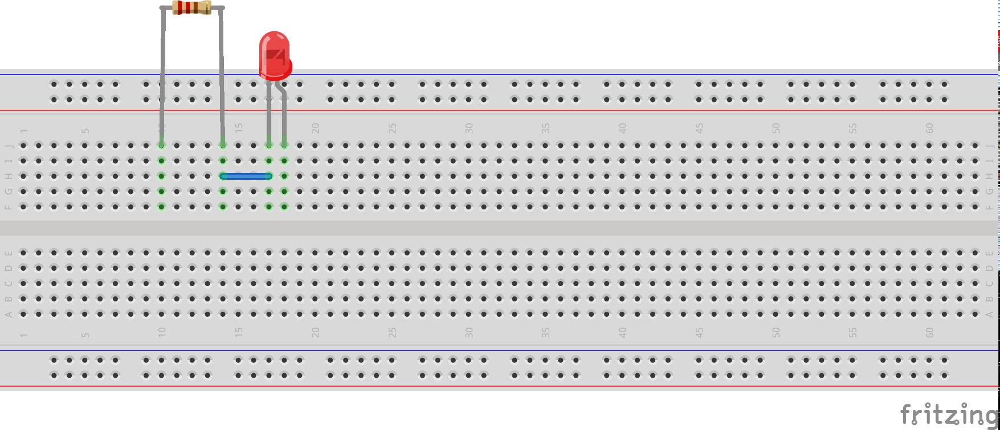

Werkzeuge
=========

Zeichenprogramm
---------------

Inkscape ist ein professionelles vektorielles Zeichenprogramm für Linux,
Windows und MAC-OSX.

   https://inkscape.org

Auf Eurem Linux-Rechner heisst das Programm ``inkscape`` und ist sicher
schon installiert. Falls nicht, dann installiert Ihr es nach mit::

   sudo apt install inkscape

**Anmerkung:** Wer ein gutes **pixelorientiertes** Zeichenprogramm sucht, der
sollte sich ``gimp`` (GNU Image Manipulation Program) ansehen. Die Homepage ist
https://www.gimp.org.

.. index:: Inkscape

Fritzing
--------

   Fritzing, http://fritzing.org

Fritzing ist ein einfach zu verstehendes Schaltplan-Programm, das die 
Elektronik auch einem nicht-professionellen Publikum näher bringen möchte. 
Es wird häufig bei Arduino-Projekten verwendet. Man kann es jedoch für 
beliebige Projekte verwenden, natürlich auch für die Dokumentation des
DVA Praktikums.

Der folgende "Steckplan" wurde mit Fritzing gezeichnet.

   Ein Fritzing Beispiel.

Auf Ihrem Linux Rechner sollte es folgende Pakete geben::

   fritzing - Easy-to-use electronic design software
   fritzing-data - Easy-to-use electronic design software (data files)
   fritzing-parts - Easy-to-use electronic design software (parts files)

Es genügt, wenn man ``fritzing`` mit

::

   sudo apt install fritzing

installiert.

.. index:: Fritzing

Schaltpläne, Platinen
---------------------

.. figure:: img/kicad-logo.png
   :scale: 100 %
   :align: center

   KiCad, http://kicad-pcb.org

KiCad ist ein professionelles Schaltplan- und Platinenzeichenprogramm, das auch
von grossen Firmen und Institutionen verwendet wird. Es steht unter der 
GPL V3 Lizenz. Folgende Pakete sind auf Ihrem Linux-Rechner bereit zur
Installation:

::

  $ apt-cache search kicad
  kicad - Electronic schematic and PCB design software
  kicad-common - Common files used by kicad
  kicad-doc-de - Kicad help files (German)
  ... (ausserdem help files fuer viele andere Sprachen)

.. index:: KiCad, Schaltplan, Platine

Serielle Schnittstelle
----------------------

Oft muss man im Labor mit dem PC externe Hardware ansteuern. Eine einfache
und deswegen oft verwendete Kommunikationsschnittstelle nach Aussen ist 
die serielle Schnittstelle.  Ältere Rechner hatten dazu noch eine oder mehrere
9-polige "Sub-D" Stecker eingebaut. Bei neueren Rechner und Notebooks 
gibt es diese meist nicht mehr, sondern man verwendet USB-zu-Seriell Adapter,
die man an die USB Schnittstelle steckt.

Die "pyserial" Bibliothek eignet sich hervorragend, um die serielle 
Schnittstelle unabhängig vom Betriebssystem (Windows, Linux, MAC-OSX)
in der Programmiersprache *Python* anzusteuern.

.. figure:: img/pyserial.png
   :scale: 100 %
   :align: center

   pyserial, https://pythonhosted.org/pyserial (im Logo sieht man noch den
   früher oft verwendeten 9-poligen SubD Steckverbinder).

.. index:: Serielle Schnittstelle, Pyserial

Diagramme
---------

Zum Zeichnen von Diagrammen empfehle ich die *Matplotlib* Bibliothek. Man
verwendet sie in der Sprache *Python*.

   Matplotlib, http://matplotlib.org

In der "Gallery" findet man viele Anwendungsbeispiele mit Python-Code:

http://matplotlib.org/gallery/index.html

.. index:: Diagramme, Plots

Python
------

.. figure:: img/python-logo-master-v3-TM.png
   :scale: 100 %
   :align: center

   Python, http://www.python.org

Ich empfehle die Programmiersprache *Python* für alle Aufgaben, bei denen
schnell Ergebnisse entstehen müssen.  Python ist eine dynamische
high-level Programmiersprache, die sich für fast alle Gebiete der
Programmierung eignet (ausser Systemprogrammierung). 

Für Technische Informatiker ist die Kombination aus *C* und *Python* 
unschlagbar. *C* eignet sich für alle Aufgaben der Systemprogrammierung
und Mikrocontrollerprogrammierung und die Sprache *Python* eignet sich
für alle restlichen *rapid-prototyping* Aufgaben.

Typische Aufgaben, die in *C* gelöst werden:

- Betriebssystementwicklung
- Treiberentwicklung
- Mikrocontrollerprogrammierung

Typische Aufgaben, die in *Python* gelöst werden:

- GUI Entwicklung
- Web-Programmierung
- Automatisierungsaufgaben
- Analyse grosser Datenmengen
- Zugriff auf Datenbanken
- Robotik
- Numerische Berechnungen (mit Numpy http://www.numpy.org)
- Ersatz von Matlab (mit SciPy https://scipy.org)
- Softwaretest

.. index:: Python

.. _webspace:

Auf Webspace übertragen
-----------------------

.. index:: Webspace, ssh, scp

In diesem Abschnitt geht es darum, wie man die mit Sphinx erzeugten HTML Seiten
auf einen Webserver überträgt, so dass man auf den Text von aussen zugreifen
kann.

Alle MitarbeiterInnen der Hochschule Augsburg haben einen *Web Space* im 
Rechenzentrum. Wenn man die RZ Kennung ``user123`` hat, dann lautet der 
URL zum Aufruf der eigenen Seite

.. code-block:: text

   https://www.hs-augsburg.de/~user123

Die Seiten werden auf dem RZ Server ``login.rz.hs-augsburg.de`` gespeichert. 
Man kann sich auf dem Server einloggen mit dem *secure shell* Kommando ``ssh``:

.. code-block:: bash

   ssh user123@login.rz.hs-augsburg.de

Nachdem man eingeloggt ist, findet man das Web-Verzeichnis unter
``/www/user123/``.  Wenn man einen mit Sphinx erzeugten Bericht auf den
Web-Space ablegen möchte, dann legt man erst auf dem RZ Server ein Verzeichnis
an, z.B. ``DVA-Bericht``:

.. code-block:: bash

   mkdir /www/user123/dva-bericht/

Danach geht man wieder auf den lokalen Rechner, auf dem der Sphinx Bericht ist.
Jetzt kann man den ganzen HTML Ausgabebaum mit *secure copy* (``scp``) kopieren:

.. code-block:: bash

   scp -r _build/html/* user123@login.rz.hs-augsburg.de:/www/user123/dva-bericht

Damit wurde das gesamte HTML Verzeichnis auf den Server übertragen. Unter dem Link 

   https://www.hs-augsburg.de/~user123/dva-bericht

kann man den Text nun sehen.

Alternativ kann man auch das ``rsync`` Werkzeug verwenden:

.. code-block:: bash

   rsync -zav --delete _build/html/ user123@login.rz.hs-augsburg.de:/www/user123/dva-bericht/

Sie können auch einen Passwortschutz einrichten. Man legt dazu die Datei
``.htaccess`` an unter::

 /var/www/user123/.htpasswd

Der folgende Text beschreibt, welche Möglichkeiten man zum Passwortschutz
hat:

https://www.hs-augsburg.de/Binaries/Binary25048/Beschreibung-eigeneHomepage.pdf

Diesen Demobericht finden Sie im HTML Format an den folgenden Stellen:

* http://hhoegl.informatik.hs-augsburg.de/dva/sphinxbericht
* https://www.hs-augsburg.de/~hhoegl/sphinxbericht

